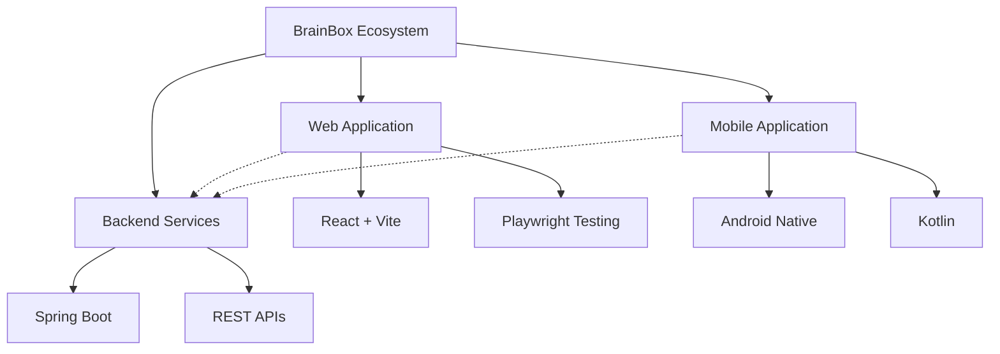

<div align="center">

# 🧠 BrainBox

**An intelligent learning management system designed to enhance educational experiences through AI-powered features**

[](LICENSE)
[]()
[]()

---

## 🚀 Quick Overview

BrainBox is a comprehensive learning platform that combines modern web technologies with mobile accessibility to create an engaging educational environment. Features include AI-powered notebooks, interactive quizzes, flashcards, and playlist management for organized learning.

---

## 📱 Platform Architecture



---

## 🛠️ Tech Stack

### Frontend (Web)
- **React 18** - Modern UI framework
- **Vite** - Lightning-fast build tool
- **TailwindCSS** - Utility-first CSS framework
- **Playwright** - End-to-end testing

### Backend
- **Spring Boot** - Java framework
- **Maven** - Dependency management
- **REST APIs** - Service communication

### Mobile
- **Android** - Native mobile application
- **Kotlin** - Modern Android development

---

## ✨ Key Features

### 🎯 Core Learning Tools
- **AI-Powered Notebooks** - Smart note-taking with AI assistance
- **Interactive Quizzes** - Dynamic assessment tools
- **Flashcard System** - Spaced repetition learning
- **Playlist Management** - Organize learning content

### 🔐 Authentication & Security
- **Secure Login/Registration** - JWT-based authentication
- **OAuth Integration** - Social login options
- **Password Recovery** - Secure password reset flow

### 📊 User Experience
- **Responsive Design** - Works on all devices
- **Dark/Light Mode** - Theme customization
- **Real-time Updates** - Live content synchronization
- **Offline Support** - Mobile app offline capabilities

---

## 🚦 Getting Started

### Prerequisites
- Node.js 18+
- Java 17+
- Android Studio (for mobile)
- Git

### Installation

1. **Clone the repository**
   ```bash
   git clone https://github.com/joanaxyz/IT342-Gako-Brainbox.git
   cd IT342-Gako-Brainbox
   ```

2. **Setup Web Application**
   ```bash
   cd web
   npm install
   npm run dev
   ```

3. **Setup Backend**
   ```bash
   cd backend
   ./mvnw spring-boot:run
   ```

4. **Setup Mobile Application**
   ```bash
   cd mobile
   ./gradlew assembleDebug
   ```

---

## 🧪 Testing

### Web Application Tests
```bash
# Run unit tests
cd web
npm test

# Run E2E tests with Playwright
npm run test:e2e
```

### Backend Tests
```bash
cd backend
./mvnw test
```

---

## 📁 Project Structure

```
brainbox/
├── 📱 mobile/           # Android application
├── 🌐 web/             # React web application
│   ├── src/
│   │   ├── components/ # Reusable UI components
│   │   ├── pages/      # Page components
│   │   └── tests/      # Test files
│   └── tests/e2e/      # Playwright E2E tests
├── ⚙️ backend/         # Spring Boot API
├── 📚 docs/            # Documentation
└── 📄 README.md        # This file
```

---

## 🔧 Development Workflow

### Branch Strategy
- `main` - Production-ready code
- `develop` - Integration branch
- `feature/*` - Feature branches
- `hotfix/*` - Critical fixes

### Code Quality
- ESLint for JavaScript/React
- Prettier for code formatting
- Playwright for E2E testing
- SonarQube integration

---

## 🤝 Contributing

1. Fork the repository
2. Create a feature branch (`git checkout -b feature/amazing-feature`)
3. Commit your changes (`git commit -m 'Add amazing feature'`)
4. Push to the branch (`git push origin feature/amazing-feature`)
5. Open a Pull Request

---

## 📊 Project Status

### ✅ Completed Features
- [x] User authentication system
- [x] Dashboard with analytics
- [x] Notebook management
- [x] Quiz creation and taking
- [x] Flashcard system
- [x] Playlist management
- [x] Mobile app foundation

### 🚧 In Progress
- [ ] AI-powered note suggestions
- [ ] Advanced analytics
- [ ] Real-time collaboration
- [ ] Offline sync improvements

### 🎯 Planned Features
- [ ] Video content support
- [ ] Study groups
- [ ] Gamification elements
- [ ] Advanced search

---

## 🐛 Bug Reporting

Found a bug? Please create an issue [here](https://github.com/joanaxyz/IT342-Gako-Brainbox/issues) with:
- Detailed description
- Steps to reproduce
- Expected vs actual behavior
- Environment details

---

## 📄 License

This project is licensed under the MIT License - see the [LICENSE](LICENSE) file for details.

---

## 🙏 Acknowledgments

- **React Team** - For the amazing UI framework
- **Spring Boot Team** - For the robust backend framework
- **Playwright Team** - For excellent testing tools
- **Open Source Community** - For making this project possible

---

## 📞 Contact

- **Project Maintainer**: [Joana XYZ](https://github.com/joanaxyz)
- **Email**: [Contact Information]
- **Project Homepage**: [GitHub Repository]

---

<div align="center">

**⭐ Star this repository if it helped you!**

Made with ❤️ by the BrainBox Team

</div>